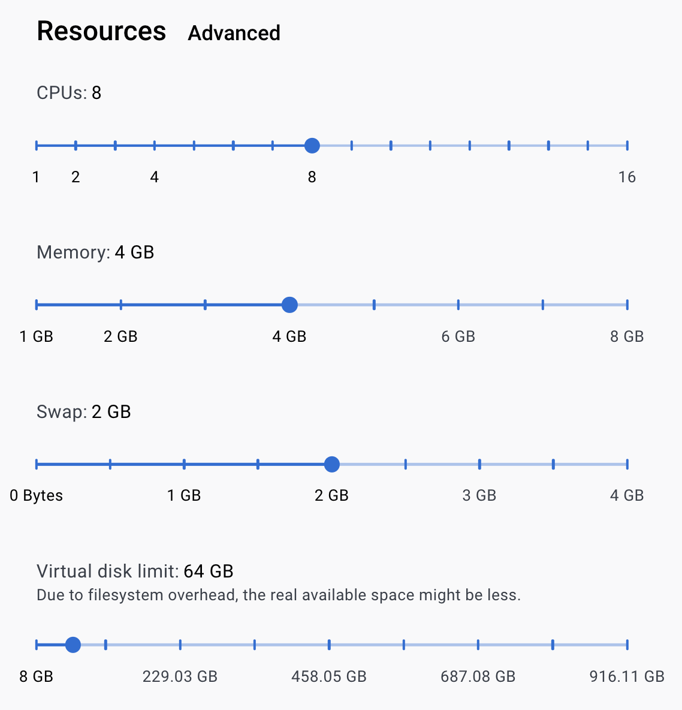
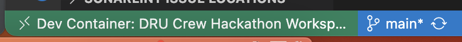
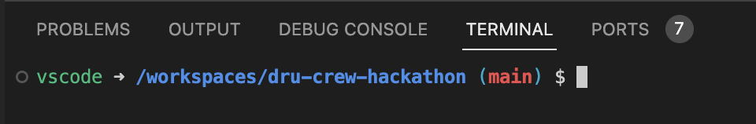

# 06_22_23 / Session 1

## Objectives

- [ ] Configure a local development environment
- [ ] Familiarize with setup
- [ ] Run the backend and frontend locally
- [ ] Establish a connection to the database (Spring Boot and Adminer)
- [ ] Establish a connection between the frontend and the backend
- [ ] Install and configure MUI
- [ ] Seed and retrieve data from the database
- [ ] Consume and display data from the Spring Boot API in the React app

## Getting Started

### 1) Docker Startup
- Start the Docker Desktop application
- Open the Settings > Resources menu
- Verify these settings (at a minimum):


### 2) Dev Container Startup
- `git clone git@github.com:probstin/dru-crew-hackathon.git && cd dru-crew-hackathon`
- Open the project in VSCode & ignore the prompts from the Dev Containers extension
- Inside the `.devcontainer` directory, create a `api.env` and a `db.env` file
- Add and save the following to the `db.env`
```properties
# .devcontainer/db.env

POSTGRES_PASSWORD=<REPLACE_ME>
POSTGRES_USER=postgres
POSTGRES_DB=hackathon

PGADMIN_DEFAULT_EMAIL=dru@crew.com
PGADMIN_LISTEN_PORT=8081
PGADMIN_DEFAULT_PASSWORD=<REPLACE_ME>
```
- Add and save the following to the `api.env`
```properties
# .devcontainer/api.env

POSTGRES_PASSWORD=<REPLACE_ME>
POSTGRES_USER=postgres
POSTGRES_DB=hackathon
POSTGRES_HOSTNAME=postgresdb
```
- In VSCode, `[ctrl | cmd] + shift + p` to open the command palette
- Search for: 'Dev Containers: Rebuild and Reopen in Container' to open your workspace
- ***This might take a few mintues***
- Click the 'show log' alert that pops up in the bottom right hand corner to watch the process

## 3) Explore your Workspace

You've now mounted your workspace into a Docker container. This container will serve as your development environment and keeps you from having to configure your OS with dependencies like Java, Node, Git, Postgres, etc.



- In VSCode, ```ctrl + shift + ` ``` to open the intergrated terminal
- You should see the following path:


## 4) Start the Spring Boot Backend

Your workspace is already preconfigured with Java and Gradle so all you have to do is start the project!

- In VSCode, `[cd | dir] backend`
- `gradle bootRun`
- On success, you should see an alert stating the application is available at localhost:8080
- Open a browser and navigate to: http://localhost:8080/hello
- Back in VSCode, `ctrl + c` in the terminal to kill the running application
- `[ctrl | cmd] + p` to open the 'DemoApplication.java' file
- Above the main method, click the `Run` link
- Once the application starts, hit `enter` after line `9`
- Paste in `System.out.println("happy tears");` and save the file
- The application should hot reload in the terminal (_this is from Spring Boot Dev Tools_)

## 5) Start the React Frontend

Your workspace is already preconfigured with Node and NPM so all you have to do is install the dependencies and start the project!

- In VSCode, `[cd | dir] frontend`
- `npm i`
- `npm run dev`
- On success, you should see an alert stating the application is available at localhost:5173
- Open a browser and navigate to: http://localhost:5173
- Back in VSCode, `[ctrl | cmd] + p` to open the 'App.tsx' file
- Change the `<h1>` to `<h1>Hello, World</h1>` and save the file
- Verify your changes are reflected in the browser

## 6) Checkout a Feature Branch and Make a Commit

- Back in VSCode, open a terminal at the root of the project
- `git checkout -b feature/<YOUR_FIRST_NAME>`
- In the left extension menu in VSCode, you should see a `2` badge over the 3rd icon (Git) indicating that you've changed two files
- Click the icon and explore the changes you've made
- Stage and commit them (either through VSC or the terminal)
- Push your branch

## 7) Use PgAdmin to connect to the database

- Open a browser and navigate to: http://localhost:8081
- Enter the `PGADMIN_DEFAULT_EMAIL` and `PGADMIN_DEFAULT_PASSWORD` defined in the `db.env` file
- Click 'Add New Server'
- Add the following:
```properties
# General

Name: local
...

# Connection

Host name / address: postgresdb
Port: 5432
Maintenance database: postgres
Username: postgres
Password: refer to POSTGRES_PASSWORD in db.env
...
```
- Click save
- Expand the 'local' server in the left menu
- Expand 'databases'
- You should see 'hackathon'
